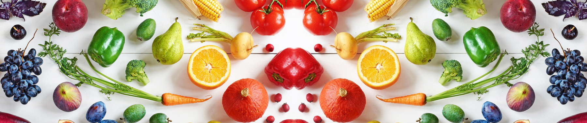
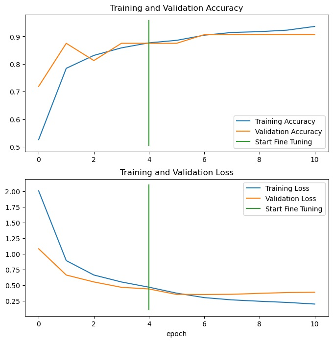
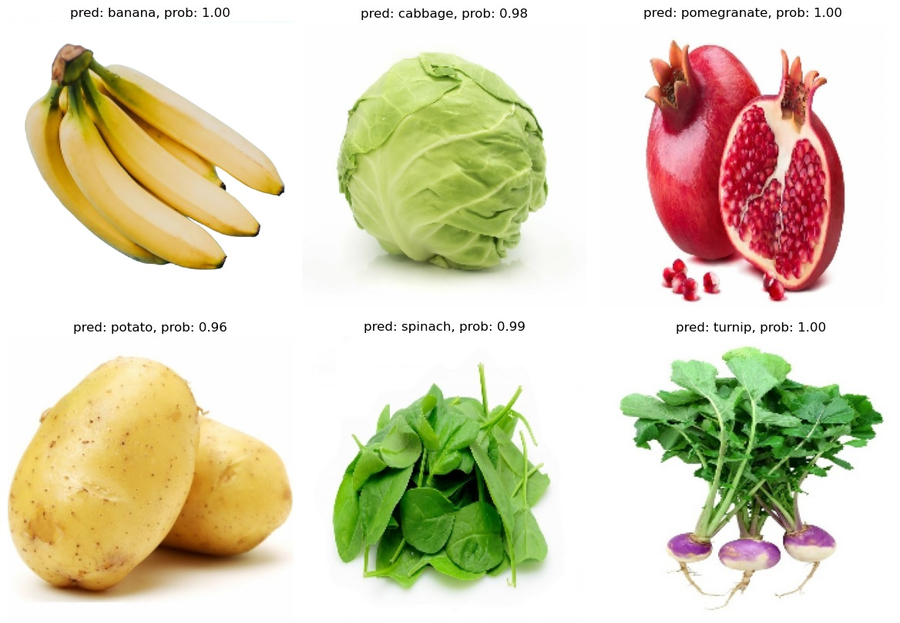

# **Deep Learning with TensorFlow**

### **Dataset**
Dataset can be accessed and downloaded from Kaggle: [Fruits and Vegetables Image Recognition Dataset](https://www.kaggle.com/datasets/kritikseth/fruit-and-vegetable-image-recognition)

This dataset contains images of fruits and vegetables, and divided into three folders: train (100 images each), test (10 images each), and validation (10 images each).

**Fruits:** banana, apple, pear, grapes, orange, kiwi, watermelon, pomegranate, pineapple, mango.

**Vegetables:** cucumber, carrot, capsicum, onion, potato, lemon, tomato, raddish, beetroot, cabbage, lettuce, spinach, soy bean, cauliflower, bell pepper, chilli pepper, turnip, corn, sweetcorn, sweet potato, paprika, jalepeño, ginger, garlic, peas, eggplant.

++ Create a folder and move images to it (dataset-cover.jpg)

### **Models**

Transfer learning is a technique in machine learning where a model developed for a task is utilized as the initial point for a model on another task. This method is particularly favored in deep learning where pre-trained models are leveraged to tackle computer vision and natural language processing tasks considering the extensive compute and time resources required to create neural network models for such problems. Transfer learning offers efficient and effective solutions by utilizing the significant performance gains achieved in similar domains.

**Transfer Learning:** All pre-trained models were implemented from [TensorFlow Hub](https://www.tensorflow.org/hub) as a starting point, moreover, fine-tuning employed to further training the pre-trained models by updating its weights.

**Fine-Tuning:** To fine-tune the base models, first set its trainable attribute to "True" (unfreezing all of the frozen). Then, since there is a relatively small training dataset, re-freeze every layer except for the last 5 (making them trainable). Check the following link to learn more about the [trainable attributes.](https://keras.io/guides/transfer_learning/)

 

| **EfficientNet Models**   | **ResNet Models**     |
| :--:                  | :--:              |
| [EfficientNetB0](https://github.com/Nimausfi/CNN_TensorFlow/blob/main/EfficientNetB0_Model.ipynb)        | [ResNet50](https://github.com/Nimausfi/CNN_TensorFlow/blob/main/ResNet50_Model.ipynb)          |
| [EfficientNetB4](https://github.com/Nimausfi/CNN_TensorFlow/blob/main/EfficientNetB4_Model.ipynb)        | [ResNet101](https://github.com/Nimausfi/CNN_TensorFlow/blob/main/ResNet101_Model.ipynb)         |
| [EfficientNetV2B0](https://github.com/Nimausfi/CNN_TensorFlow/blob/main/EfficientNetV2B0_Model.ipynb)      | [ResNet101V2](https://github.com/Nimausfi/CNN_TensorFlow/blob/main/ResNet101V2_Model.ipynb)       |

 

### **Performance Evaluation**

Results for evaluating predictions such as confusion matrix, f1 score for each class, and finding most wrong predictions can be found in the source codes.

**Learning curves for training and validation metrics** (fine-tuned EfficientNetB0 model)

**Comparing the accuarcy scores of base and fine-tuned models on the whole test dataset**

|  **Models**            |   **Accuracy (base models)**  |  **Accuracy (fine-tuned models)**    |
| :--:                   | :--:                          | :--:                                 |
|  **EfficientNetB0**    |     0.89972144                |    **0.93314760**                    |
|  **EfficientNetB4**    |     0.88579386                |    0.91643452                        |
|  **EfficientNetV2B0**  |     0.89136493                |    0.93036210                        |
|  **ResNet50**          |     **0.91922003**            |    0.90529245                        |
|  **ResNet101**         |     0.89693593                |    0.92200559                        |
|  **ResNet101V2**       |     0.90529245                |    0.91086351                        |

**Visualizing predictions on custom images**

